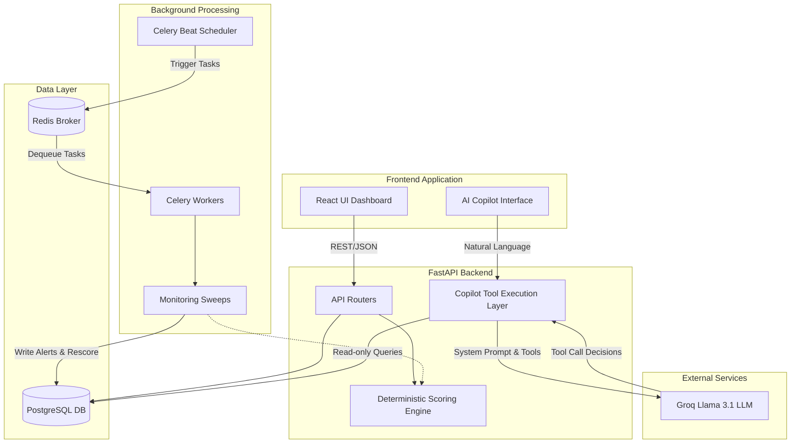

# VendorSentry

VendorSentry is an AI-powered third-party risk intelligence platform designed to automate and simplify the complex process of vendor risk management. 

Traditional third-party risk assessments are manual, siloed, and reactive. Security and compliance teams often struggle to maintain real-time visibility into their vendor ecosystem, track expiring certifications, and respond to sudden security breaches. VendorSentry solves this by aggregating vendor data, automating continuous monitoring, and providing an AI Copilot that allows analysts to query the live database using natural language.

## 🎯 Key Objectives & Use Case

The primary objective of VendorSentry is to enable security and compliance teams to:
- **Maintain real-time visibility** into their vendor ecosystem through a unified dashboard.
- **Automatically detect compliance degradation** (e.g., expiring SOC2 certifications, contract renewals).
- **Quantify risk deterministically** using a transparent, multi-factor scoring engine.
- **Query vendor data seamlessly** via an AI Copilot without needing to write SQL or navigate complex dashboards.

## ✨ Implemented Features

*Note: The following features are fully implemented and genuinely present in the codebase.*

- **Vendor Portfolio & CRUD**: Comprehensive registry to manage vendor profiles, data access scopes (PII, Financial), and contract lifecycle details.
- **Deterministic Risk Scoring Engine**: A pure-code, weighted scoring algorithm evaluating four parameters (Breach History, Data Access Scope, Compliance Maturity, and Financial Stability). AI is used solely to generate a human-readable rationale summarizing the final score.
- **Automated Background Monitoring**: Celery-backed sweeps that run continuously to detect expiring certifications, upcoming contract renewals, and overdue assessments.
- **Smart Alerting System**: Generates deduplicated alerts when anomalies are found during background sweeps, preventing alert fatigue.
- **Interactive AI Copilot**: A conversational interface powered by LLM tool-calling that translates natural language into safe, read-only internal queries against the live Postgres database. Includes strict data provenance tracking.
- **Visual Dashboard**: High-level visual command center featuring a risk heatmap and historical risk trends.
- **Data Ingestion via CSV**: Fault-tolerant bulk ingestion scripts capable of seeding the database with legacy vendor records.

## 🛠️ Technology Stack

### Frontend
* **React 19 & Vite**: Provides a fast, highly responsive modern web application.
* **Tailwind CSS & Radix UI (shadcn/ui)**: For styling and accessible, interactive components (e.g., sliding drawers, data grids, modals).
* **Framer Motion**: Adds subtle micro-animations for enhanced user experience.
* **React Query**: For efficient data fetching and caching.

### Backend
* **Python 3.11 & FastAPI**: High-performance asynchronous framework powering the REST API and the AI execution loop.
* **PostgreSQL & SQLAlchemy (ORM)**: Relational database for persistent storage, using Alembic for migrations.
* **Celery & Redis**: Redis acts as the message broker and result backend for Celery, which handles asynchronous background processing (monitoring sweeps).
* **Groq API (Llama 3.1 8B)**: Provides low-latency natural language understanding for the Copilot and rationale generation, ensuring high performance at a fraction of the token cost.

## 🏗️ System Architecture



## 🔄 Detailed Data Flow

### 1. AI Copilot Query Flow
1. **User Request**: The analyst asks the Copilot, "Show me all high-risk vendors with access to PII."
2. **LLM Evaluation**: The FastAPI backend sends the prompt and a strict JSON schema of available tools to the Groq LLM.
3. **Tool Selection**: The LLM determines it needs to call `search_vendors` with parameters `{"tier": "HIGH", "has_pii": true}`.
4. **Local Execution**: FastAPI intercepts the tool call, securely executes a read-only SQLAlchemy query against the PostgreSQL database, and formats the results.
5. **Response Generation**: The raw data is sent back to the LLM, which formats a helpful markdown response (including a table).
6. **Delivery**: The frontend renders the markdown and explicitly displays the API endpoint used as a citation for data provenance.

### 2. Automated Monitoring Flow
1. **Schedule Trigger**: Celery Beat is configured to run `check_cert_expiry` daily at 6:00 AM UTC.
2. **Data Polling**: A Celery worker picks up the task and queries PostgreSQL for any active `Certification` records expiring within the next 30 days.
3. **Anomaly Detection**: For every match found, the worker attempts to create an `Alert`.
4. **Deduplication**: A hash-based `dedup_key` (e.g., `cert-expiry-<vendor_id>-<cert_id>`) ensures that multiple runs do not create duplicate alerts.
5. **Notification & Rescore**: The new alert is saved to the database, and a background vendor rescore is triggered, potentially degrading the vendor's risk tier to "Elevated". The updated status is instantly available on the portfolio dashboard.

## 📦 Major Modules & Responsibilities

* **`app/api/`**: Contains the FastAPI route handlers.
  * `vendors.py`: Vendor CRUD operations and list filtering.
  * `copilot.py`: The AI chat endpoint and tool-execution loop.
  * `scoring.py`: Endpoints to manually trigger scoring.
* **`app/services/`**: Core business logic.
  * `scoring/engine.py`: The pure-code deterministic risk formula.
  * `monitoring/`: Celery task definitions for background sweeps.
* **`app/models/`**: SQLAlchemy ORM definitions.
* **`app/src/` (Frontend)**: React application containing UI layouts, pages, and Shadcn components.

## 🗄️ Database Design

The PostgreSQL database is structured to decouple core vendor identity from highly volatile risk data:

* **`vendors`**: The central entity storing identity, contract dates, annual spend, and overall status.
* **`data_access_scopes`**: A 1-to-1 mapping detailing whether a vendor has access to internal systems, PII, or financial data.
* **`vendor_scores`**: A historical ledger of risk scores (composite, breach subscore, compliance subscore) and AI-generated rationales. The most recent row determines current standing.
* **`alerts`**: Tracks anomalies requiring analyst review, linked back to the vendor. Includes resolution timestamps.
* **`certifications` & `breach_events`**: 1-to-many tables storing compliance audits (e.g., SOC2, ISO27001) and historical security incidents.

## 🔌 API Overview

Below is a summary of the core endpoints exposed by the backend:

| Endpoint | Method | Description |
|----------|--------|-------------|
| `/api/v1/vendors` | GET | List and filter vendors (supports pagination, search, tier filtering). |
| `/api/v1/vendors/{id}` | GET | Retrieve a comprehensive vendor profile including score history and active alerts. |
| `/api/v1/vendors` | POST | Create a new vendor and their initial data access scope. |
| `/api/v1/scoring/{vendor_id}/rescore` | POST | Manually trigger the deterministic scoring engine for a vendor. |
| `/api/v1/alerts` | GET | Fetch active, unresolved alerts across the portfolio. |
| `/api/v1/copilot/chat` | POST | Submit natural language queries to the AI Copilot. |

## 🚀 Setup & Installation

### Prerequisites
* Docker and Docker Compose installed on your system.

### Running Locally with Docker (Recommended)

1. **Clone the repository:**
   ```bash
   git clone <repository_url>
   cd VendorSentry
   ```

2. **Configure Environment Variables:**
   The `docker-compose.yml` relies on an `.env` file in the `backend/` directory. Ensure you have your LLM API keys set up.
   ```bash
   cd backend
   cp .env.example .env
   # Edit .env and add your GROQ_API_KEY
   cd ..
   ```

3. **Start the Infrastructure & Applications:**
   This command builds the frontend, backend, and starts PostgreSQL and Redis.
   ```bash
   docker compose up --build -d
   ```

4. **Seed the Database:**
   Wait a moment for the database to fully initialize, then run the seed script to populate tables with sample data and run initial migrations:
   ```bash
   docker compose exec api python scripts/seed.py
   ```

5. **Access the Application:**
   * **Frontend UI**: [http://localhost:5173](http://localhost:5173)
   * **Backend API**: [http://localhost:8000](http://localhost:8000)
   * **Interactive API Docs**: [http://localhost:8000/docs](http://localhost:8000/docs)
